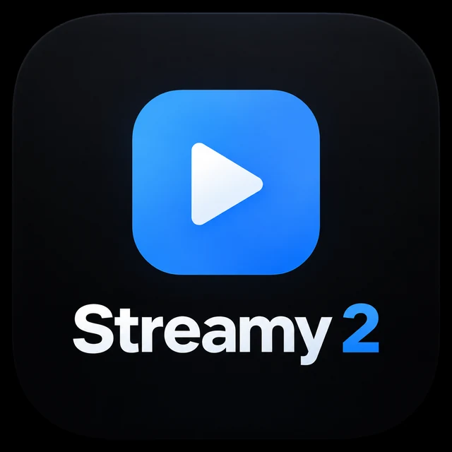

<p align="center">
  
</p>

<h1 align="center">Streamy 2</h1>

<p align="center">
  Moderner IPTV-Client für Android TV, Fire TV, Smartphone und Tablet.
</p>

<p align="center">
  <a href="https://github.com/daniel96865-a11y/streamy2/releases/tag/v3.38"></a>
  
  
</p>

<p align="center">
  
</p>

## 📥 Downloads

| Gerät | Version | Download |
|---|---:|---|
| 📺 **Streamy 2 TV** — Android TV / Fire TV | 3.38 | **[TV-APK herunterladen](https://github.com/daniel96865-a11y/streamy2/releases/download/v3.38/Streamy2-TV-3.38.apk)** |
| 📱 **Streamy 2 Mobile** — Smartphone / Tablet | 3.38 | **[Mobile-APK herunterladen](https://github.com/daniel96865-a11y/streamy2/releases/download/v3.38/Streamy2-Mobile-3.38.apk)** |

<p align="center">
  <a href="https://github.com/daniel96865-a11y/streamy2/releases/tag/v3.38"><b>➡️ Release-Seite öffnen</b></a>
</p>

> **Hinweis zur ersten Installation von 3.38:** Die neue TV-Linie verwendet eine neue Release-Signatur. Eine ältere TV-Installation mit anderer Signatur muss vor der ersten Installation der neuen TV-Linie deinstalliert werden. Streamy 2 Mobile ist ab 3.38 eine eigenständige App.

## ✨ Funktionen

- 📡 **Xtream** — Zugangsdaten hinterlegen und Inhalte laden
- 📺 **Live-TV** — Senderlisten mit Kategorien und Suche
- 🗓️ **EPG** — aktuelle und kommende Sendungen im Überblick
- 🎬 **Filme** — übersichtliche Mediathek mit Suche und Kategorien
- 📚 **Serien** — Serien und Staffeln getrennt verwalten
- 🎮 **TV-Bedienung** — für Fernbedienung und D-Pad optimiert
- 📱 **Mobile-App** — eigene App-Linie für Smartphone und Tablet
- 🔄 **Getrennte Updates** — TV und Mobile erhalten unabhängige Update-Kanäle

## 📱 Zwei eigenständige App-Linien

| Variante | Paket-ID | Geräte |
|---|---|---|
| **Streamy 2 TV** | `app.streamy2` | Android TV / Fire TV |
| **Streamy 2 Mobile** | `app.streamy2.mobile` | Smartphone / Tablet |

Beide Varianten werden aus demselben Quellcode gebaut und sind ARM-only (`armeabi-v7a` + `arm64-v8a`).

## 🔄 Update-Kanäle

- TV ab 3.38: `docs/streamy2-tv.json` / `docs/streamy2-tv.txt`
- Mobile ab 3.38: `docs/streamy2-mobile.json` / `docs/streamy2-mobile.txt`
- Alte TV-Signaturlinie: `docs/streamy2.json` / `docs/streamy2.txt`

Damit kann ein Mobile-Update nicht an TV-Geräte verteilt werden und umgekehrt.

<details>
<summary><b>🛠️ Build & Signierung</b></summary>

### Build

```bash
export JAVA_HOME=/workspace/jdk ANDROID_SDK_ROOT=/workspace/android-sdk
./gradlew :app:assembleTvRelease
./gradlew :app:assembleMobileRelease
```

Ausgaben:

- TV: `app/build/outputs/apk/tv/release/`
- Mobile: `app/build/outputs/apk/mobile/release/`

### Signierung

TV und Mobile der neuen Linie müssen ab 3.38 mit demselben privaten **Streamy 2 Release**-Schlüssel signiert werden. Der private Keystore wird nicht im öffentlichen Repository gespeichert.

Veröffentlichte APKs werden vor dem Release mit Android `apksigner` geprüft. Die 3.38-Release-Linie verwendet APK Signature Scheme v2/v3.

</details>

## 🆕 Version 3.38

- TV und Mobile als getrennte App-Pakete
- eigener Update-Kanal je Geräteklasse
- neuer gemeinsamer Release-Signierschlüssel für die neue Linie
- Android-Signatur v2/v3
- getrennte GitHub-Downloads für TV und Mobile
